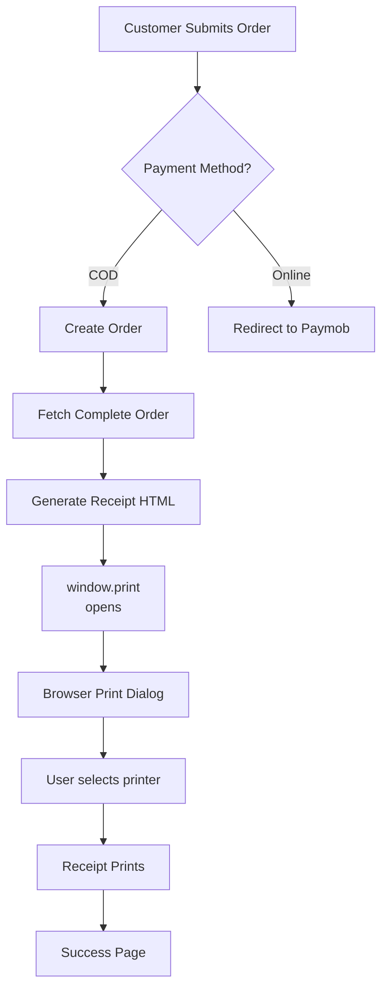

# 🖨️ Browser Print API - Receipt Printing for zadfitt.com

## ✅ Updated Configuration

تم تحديث نظام الطباعة للعمل **مع المواقع المستضافة** (hosted websites) على zadfitt.com

## 📍 المشكلة الأصلية ➡️ الحل الجديد

### قبل (USB Printer - محلي فقط):
- ❌ طابعة USB متصلة بـ localhost فقط
- ❌ لا تعمل على zadfitt.com (hosted)
- ❌ يحتاج drivers

### الآن (Browser Print API - محلي من أي جهاز):
- ✅ طباعة من متصفح المستخدم 
- ✅ تعمل على zadfitt.com و localhost
- ✅ بدون drivers - استخدام نظام التشغيل مباشرة

---

## 🚀 كيفية العمل

### 1️⃣ العميل يضع أوردر COD على zadfitt.com:
```
checkout → completes order → automatic print dialog opens
```

### 2️⃣ نافذة الطباعة تفتح تلقائياً:
```
[Print Dialog appears]
├─ Select Printer (USB Thermal Printer)
└─ Click Print
```

### 3️⃣ الفاتورة تطبع:
- الحجم: 58mm (compatible with XPrinter 370B)
- العربية: مدعومة بالكامل
- المعلومات: Order ID, Items, Total, etc.

---

## 📋 محتوى الفاتورة

```
🛍️ فاتورة
ZADFITT.COM
─────────────────
رقم الأوردر: XXX123
التاريخ: 1/4/2026

📋 بيانات العميل
الاسم: محمد أحمد
الهاتف: 01234567890
البريد: ...
العنوان: ...

🛒 المشتريات
- T-Shirt Classic
  المقاس: L • اللون: Black
  2 × 149.99 = 299.98

─────────────────
الإجمالي الجزئي: 299.98
الخصم (10%): -29.99
التوصيل: 50.00
─────────────────
الإجمالي: 320.99

طريقة الدفع: 💵 الدفع عند الاستلام

شكراً لتعاملك معنا! 💚
www.zadfitt.com
```

---

## 🔧 التثبيت والإعدادات

### Windows:
1. **تثبيت الطابعة**:
   - Settings → Devices & Printers
   - Add a printer
   - Select "XPrinter 370B" 

2. **في المتصفح**:
   - لا يوجد إعدادات إضافية
   - تختار الطابعة من نافذة الطباعة

### Mac/Linux:
- نفس الخطوات - نظام التشغيل سيدعم الطابعة

---

## 📁 الملفات ذات الصلة

### Frontend (Browser):
- **[src/app/checkout/checkout-client.tsx](src/app/checkout/checkout-client.tsx)**
  - `generateReceiptHTML()` - توليد HTML الفاتورة
  - `printReceipt()` - استدعاء window.print()

### Backend (Server):
- **[src/lib/actions/order-actions.ts](src/lib/actions/order-actions.ts)**
  - `createOrder()` - إنشاء الأوردر
  - `getOrderById()` - جلب الأوردر مع items و products

---

## ⚡ Flow شامل



---

## ✅ المميزات

- ✓ **لا يحتاج backend** - كل شيء في المتصفح
- ✓ **آمن** - بيانات محلية فقط
- ✓ **سريع** - بدون تأخير
- ✓ **مرن** - المستخدم يختار الطابعة
- ✓ **عالمي** - يعمل على أي موقع hosted
- ✓ **عربي** - دعم كامل للغة العربية

---

## ⚠️ ملاحظات

1. **الطابعة لازم متصلة** بجهاز المستخدم
2. **الطباعة تفتح على COD فقط** (أوامر الدفع الأخرى بدون طباعة)
3. **نافذة الطباعة تفتح تلقائياً** (يمكن الإغلاق بـ Esc)
4. **الفاتورة بتخزن في browser** (مش في server)

---

## 🔍 استكشاف الأخطاء

### المشكلة: لا تفتح نافذة الطباعة
- **الحل**: تأكد من عدم حظر pop-ups من المتصفح
- **الحل**: أعد تحميل الموقع

### المشكلة: الطابعة غير متصلة
- **الحل**: تحقق من USB connection
- **الحل**: شغل الطابعة من Settings

### المشكلة: الفاتورة بتطبع بشكل غير صحيح
- **الحل**: غير إعدادات الصفحة من نافذة الطباعة
- **الحل**: جرب "Save as PDF" أولاً

---

## 📱 Mobile Support

على الهاتف:
- iPhone: Print → select AirPrint printer
- Android: Print → select printer
- نفس الفاتورة تطبع بنفس الجودة

---

## تم توقف الملفات التالية:

❌ `src/lib/printer/xprinter.ts` - USB printer (لا يستخدم)
❌ `src/lib/printer/qr-receipt.ts` - QR generation (لا يستخدم)
❌ `src/components/checkout/print-button.tsx` - ازيل (auto print)
❌ `src/components/admin/print-button.tsx` - ازيل (no backend access)

✅ كل شيء يعمل الآن من العميل (client-side) بدون حاجة backend!
